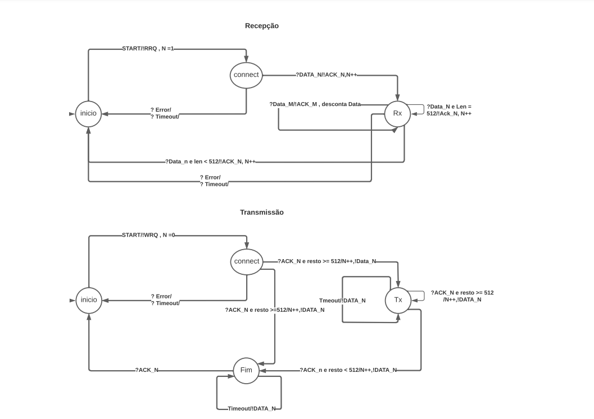

<h1 align='center'>Projeto 1 - Protocolo <a href="https://datatracker.ietf.org/doc/html/rfc1350">TFTP</a> Cliente</h1>
<p align="center">Projeto de desenvolvimento de um cliente para o protocolo TFTP</p>

Tabela de conteúdos
=================
<!--ts-->
   * [Objetivos](#Objetivos)
   * [Pré-requisitos](#Pré-requisitos)
   * [Instruções para Uso](#Instruções-para-Uso)
   * [Máquina de Estado Finita do Protocolo TFTP](#Máquina-de-Estado-Finita-do-Protocolo-TFTP)
   * [Autores](#Autores)
<!--te-->
## Protocolo TFTP
É um protocolo de transferência de ficheiros utilizado para transferir pequenos ficheiros entre hosts numa rede que é baseado no modelo cliente-servidor para funcionamento, usa um canal não confiável característico de utilização de envios UDP.
O protocolo envia cinco tipos de mensagens, sendo elas RRQ,WRQ,DATA,ACK e ERROR todas as mensagens possuem no cabeçalho um OPCODE que é usado para identificação de associação de um pacote.

Algumas transferências começam com um pedido de leitura ou escrita de um arquivo (WRQ, RRQ) e recebem uma resposta positiva, um pacote de confirmação a ser escrito ou o primeiro pacote a ser lido. Geralmente, o pacote de confirmação inclui o número do bloco do pacote de dados de confirmação. Cada pacote está associado a um número de bloco; os números de bloco são consecutivos e começam com 1. Como a resposta positiva a uma solicitação de gravação é um pacote de confirmação, o número do bloco pode ser zero nesse caso específico. Se a resposta for um pacote de erro, a solicitação será rejeitada.
Para criar uma conexão, cada extremidade da conexão escolhe um TID para usar durante a conexão. Cada pacote possui dois TIDs associados aos endpoints da conexão, o TID de origem e o TID de destino. TID 69 decimal (105 octal) é usado para sua conexão.


## Objetivos

1. **Desenvolver uma biblioteca**: o cliente do protocolo TFTP deve ser feito na forma de uma biblioteca, de forma que possa ser reutilizado em aplicações que precisem desse protocolo.
2. **Escrever um aplicativo demonstrativo**: usando sua biblioteca, deve-se criar um aplicativo capaz de enviar e receber arquivos usando o protocolo TFTP.

## Pré-requisitos

1. Instalar o programa cliente e o servidor TFTP:
```bash

sudo apt-get update

sudo apt-get install xinetd tftpd tftp -y

sudo cp /tftp /etc/xinetd.d/tftp 

mkdir /tftpboot

sudo chmod -R 777 /tftpboot

sudo chown -R nobody /tftpboot

sudo service xinetd restart

sudo cp dummy-files/ /tftpboot

```

2. Instalar as dependências necessárias para a execução do projeto:
```bash
sudo apt update

sudo apt install python3
```

3. Caso deseje instalar o Docker para testes, como descrito em sua <a href="https://docs.docker.com/engine/install/ubuntu/">documentação</a>

## Instruções para Uso

1. Utilizar métodos <a href="https://github.com/mmsobral-croom/projeto-1-um-protocolo-de-transferencia-de-arquivos-ptc-arthur-jefferson/blob/0e2dbf31fa336adbffae80e14a99b946f9ef97ed/client/clientTftp.py#L41">GET</a> ou <a href="https://github.com/mmsobral-croom/projeto-1-um-protocolo-de-transferencia-de-arquivos-ptc-arthur-jefferson/blob/0e2dbf31fa336adbffae80e14a99b946f9ef97ed/client/clientTftp.py#L67">PUT</a>

- GET : python3 tests.py ``ip-do-servidor`` ``porta-servidor`` ``tempo-de-timeout`` ``nome-do-arquivo`` 1
```bash
python3 tests.py 127.0.0.1 69 10 teste.txt 1
```
- PUT (é necessário que o arquivo já exista no servidor para poder testar): python3 tests.py ``ip-do-servidor`` ``porta-servidor`` ``tempo-de-timeout`` ``nome-do-arquivo`` 2
```bash
python3 tests.py 127.0.0.1 69 10 teste.txt 2
```


2. Utilizar o Dockerfile para instanciar um container como Servidor TFTP, seguida utilizar os comandos abaixo para verificar o IP do Servidor, e iniciar o container com a porta deseja em exposta:

```bash
docker ps

docker inspect <container ID>

docker inspect <container id> | grep "IPAddress"

docker run -i --expose=<port> <container id> bash
```

3. Instânciar um objeto do tipo ``ClienteTFTP`` onde o mesmo deve ser construído por meio de passagem de parâmetros de ``IP, PORT, timeout e estado`` e para o manejo do cliente é possível útilizar os métodos:
- get: Para requisição de leitura
- put: Para requisição de escrita em um arquivo 
- __handle_idle: Para mudança de estado ocioso contando com o timeout
- __handle_connect: Para mudança de estado conectado da comunicação.
- __handle_rx: Para mudança de estado recebimento da comunicação. 
- __handle_tx: Para mudança de estado transmissão da comunicação.
- __handle_end:Para mudança de estado encerramento da comunicação.

## Máquina de Estado Finita do Protocolo TFTP

</img>

## Autores

<a href="https://github.com/ArthurAnastopulos">
    <br />
    <sub><b>Arthur Anastopulos dos Santos</b></sub></a><br />

<a href="https://github.com/alanamandim">
    <br />
    <sub><b>Alana Mandim</b></sub></a><br />

<a href="https://github.com/jeffersonbcr">
    <br />
    <sub><b>Jefferson Botitano</b></sub></a>

